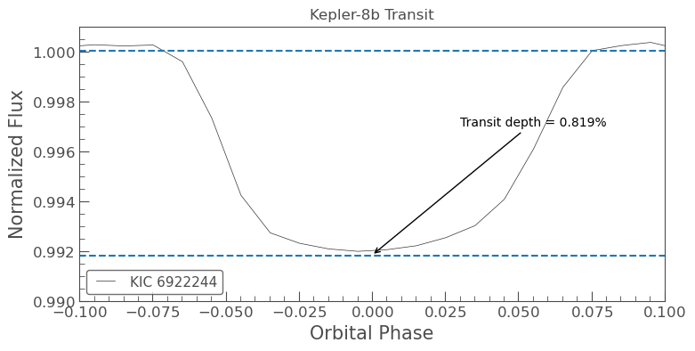

# Objective

This project attempts to reproduce basic published properties
of the exoplanet Kepler-8b using publicly available Kepler
photometric data. This is an independent practice project using real astronomical data and exoplanet light curves

The primary goals are to:

- recover the orbital period using Box-Least Squares (BLS)
- measure the transit depth
- estimate the planet-to-star radius ratio
- estimate the planet's radius
- compare the results with published values

# Data

Kepler target: KIC 6922244

Mission: Kepler

Quarter: 4

Cadence: Long cadence

Data source: MAST

The light curve was downloaded using the Python package Lightkurve.

# Methods

I used Kepler Quarter 4 long-cadence observations of KIC 6922244, the host star of Kepler-8b, and analyzed the data using Python and Lightkurve.

The analysis followed these steps:

1. Downloaded the Kepler light curve using Lightkurve.
2. Removed NaN values and extreme outliers and normalized the flux.
3. Used a Box-Least Squares (BLS) periodogram to search for the repeating transit signal.
4. Identified the orbital period corresponding to the maximum BLS power and the associated transit epoch.
5. Flattened the light curve to remove long-term variations in the stellar brightness.
6. Tested several flattening window lengths (101, 201, 401, and 801) to determine how the choice of detrending timescale affected the measured transit depth.
7. Selected a window length of 401 as a reasonable compromise between removing long-term trends and preserving the transit signal.
8. Folded the light curve using the BLS orbital period and transit epoch so that observations from different orbital cycles could be aligned.
9. Binned the folded light curve using a phase bin size of 0.01 to reduce random scatter and make the transit easier to visualize.
10. Measured the median in-transit and out-of-transit flux and used these values to calculate the fractional transit depth.
11. Used the transit depth to estimate the planet-to-star radius ratio
12. Used the published stellar radius of Kepler-8 to estimate the radius of Kepler-8b.
13. Compared the estimated planetary radius with the published value.

# Results

Using a Box-Least Squares periodogram, I recovered an orbital period of approximately 3.520 days for Kepler-8b. This is close to the published orbital period of approximately 3.523 days.

After flattening the light curve with a window length of 401, folding the observations using the BLS period and transit epoch, and binning the folded light curve with a time_bin_size of 0.01, I measured a transit depth of approximately 0.819%.

Using the relationship Rp/Rstar = √depth,  I estimated a planet-to-star radius ratio of:
Rp/Rstar = 0.090

This indicates that the radius of Kepler-8b is approximately 9% of the radius of its host star. Using a published stellar radius of 1.56 R☉, I estimated the physical radius of Kepler-8b to be approximately 1.405J R_J. The published radius of Kepler-8b is 1.419 R_J. My estimated radius differed from the published value by approximately 1.021%.

Overall, this analysis successfully reproduced the main transit properties of Kepler-8b using Kepler Quarter 4 observations and a simplified Lightkurve-based analysis.

# Figures 

**Figure 1.** Folded and binned light curve of Kepler-8b using a flattening window of 401 and a time bin size of 0.01. The transit is centered near orbital phase 0. The dashed lines indicate the median in-transit and out-of-transit fluxes used to calculate the transit depth.

# Limitations

This analysis has several limitations. First, I used only Kepler Quarter 4 rather than the complete available Kepler dataset. Second, the measured transit depth depends on the choice of flattening window, as demonstrated by the window-length experiment. The choice of phase boundaries used to define the in-transit and out-of-transit regions may also affect the measured depth. In addition, Kepler's long-cadence observations provide limited time resolution compared with the actual duration of the transit. Finally, the planetary radius estimate depends directly on the adopted stellar radius, so uncertainty in the stellar parameters contributes to uncertainty in the planet-radius estimate.

# Data & acknowledgments
This project makes use of data and services provided by the NASA Exoplanet Archive, operated by the California Institute of Technology under contract with NASA's Exoplanet Exploration Program. Kepler data were obtained from the Mikulski Archive for Space Telescopes (MAST).

# Software

- Python
- NumPy
- Matplotlib
- Jupyter notebook
- Lightkurve
- Astropy
